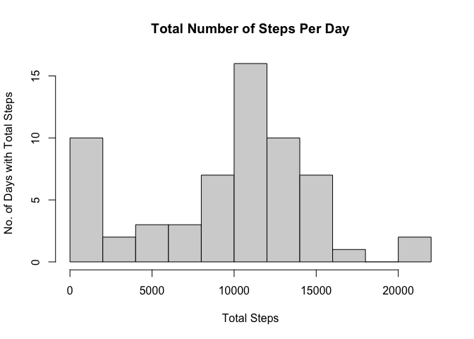
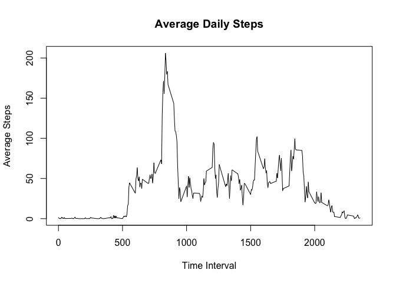
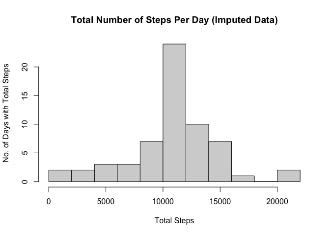
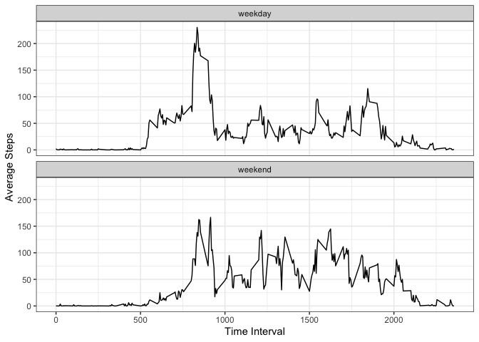

```r
knitr::opts_chunk$set(fig.path = "figures/")
```

## Loading and preprocessing the data

The activity data is in a zipped file in the working directory. We can create a connection that unzips it and reads the .csv file inside. The data is read as a `tibble` (from the `dplyr` package) as it makes it easier to work with.

The `dplyr` package automatically loads (along with others) when opening the `tidyverse` package.


```r
library(tidyverse)
```

```
## ── Attaching packages ────────────────────────────────── tidyverse 1.3.0 ──
```

```
## ✓ ggplot2 3.3.0     ✓ purrr   0.3.4
## ✓ tibble  3.0.1     ✓ dplyr   0.8.5
## ✓ tidyr   1.1.0     ✓ stringr 1.4.0
## ✓ readr   1.3.1     ✓ forcats 0.5.0
```

```
## ── Conflicts ───────────────────────────────────── tidyverse_conflicts() ──
## x dplyr::filter() masks stats::filter()
## x dplyr::lag()    masks stats::lag()
```


```r
activitydata <- as_tibble(read.csv(unz("activity.zip", "activity.csv")))
```

The date variable will be formatted as a `date` class instead of `character`. For this, the `lubridate` package can be used.


```r
library(lubridate)
```

```
## 
## Attaching package: 'lubridate'
```

```
## The following objects are masked from 'package:dplyr':
## 
##     intersect, setdiff, union
```

```
## The following objects are masked from 'package:base':
## 
##     date, intersect, setdiff, union
```


```r
activitydata$date <- ymd(activitydata$date)
```

## What is mean total number of steps taken per day?

Using `dplyr` functions, the data will be grouped by the date. The total steps for each date will be computed (NA's are ignored).


```r
days <- group_by(activitydata, date) %>%
        summarise(total_steps = sum(steps, na.rm = TRUE))
```

A histogram of the total number of steps per day is made (using the `base` plotting system).


```r
hist(days$total_steps, breaks = 15, main = "Total Number of Steps Per Day",
     xlab = "Total Steps", ylab = "No. of Days with Total Steps")
```

<!-- -->

The mean and median total number of steps per day are calculated below:


```r
summary(days$total_steps)
```

```
##    Min. 1st Qu.  Median    Mean 3rd Qu.    Max. 
##       0    6778   10395    9354   12811   21194
```

We can see the mean = **9354** steps and the median = **10395** steps.

## What is the average daily activity pattern?

Again, we can use `dplyr` functions to group the `activitydata` by the time intervals and then compute the average steps for each time interval (NA's are ignored).


```r
interval <- group_by(activitydata, interval) %>%
        summarise(mean_steps = mean(steps, na.rm = TRUE))
```

A time series of the average daily steps is made (using the `base` plotting system).


```r
plot(interval$interval, interval$mean_steps, type = "l",
     main = "Average Daily Steps",
     xlab = "Time Interval", ylab = "Average Steps")
```

<!-- -->

Which 5-minute interval contains the maximum average number of steps?


```r
filter(interval, mean_steps == max(mean_steps))
```

```
## # A tibble: 1 x 2
##   interval mean_steps
##      <int>      <dbl>
## 1      835       206.
```

We can see the 5-minute time interval with the maximum average number of steps is the **835** interval with **~206** steps.

## Imputing missing values

We can find the number of rows in `activitydata` with missing values (NA's).

First let's check which of the three variables (`steps`, `date` and `interval`) have missing values.


```r
sum(is.na(activitydata$steps))
```

```
## [1] 2304
```


```r
sum(is.na(activitydata$date))
```

```
## [1] 0
```


```r
sum(is.na(activitydata$interval))
```

```
## [1] 0
```

So only the `steps` variable has missing values - **2304** of them. Therefore, there are 2304 rows with missing values in the `activitydata` data set.

We will impute these NA's with the average step number for the NA's time interval. These averages are found in the `interval` tibble.


```r
activitydata_imputed <- activitydata
for(i in 1:nrow(activitydata_imputed)) {
        if(is.na(activitydata_imputed$steps[i])) {
                activitydata_imputed$steps[i] <- interval$mean_steps[
                        which(activitydata_imputed$interval[i] == interval$interval)]
        } else {}
}
```

We can compare the original `activitydata` and imputed `activitydata_imputed`.


```r
activitydata
```

```
## # A tibble: 17,568 x 3
##    steps date       interval
##    <int> <date>        <int>
##  1    NA 2012-10-01        0
##  2    NA 2012-10-01        5
##  3    NA 2012-10-01       10
##  4    NA 2012-10-01       15
##  5    NA 2012-10-01       20
##  6    NA 2012-10-01       25
##  7    NA 2012-10-01       30
##  8    NA 2012-10-01       35
##  9    NA 2012-10-01       40
## 10    NA 2012-10-01       45
## # … with 17,558 more rows
```

```r
activitydata_imputed
```

```
## # A tibble: 17,568 x 3
##     steps date       interval
##     <dbl> <date>        <int>
##  1 1.72   2012-10-01        0
##  2 0.340  2012-10-01        5
##  3 0.132  2012-10-01       10
##  4 0.151  2012-10-01       15
##  5 0.0755 2012-10-01       20
##  6 2.09   2012-10-01       25
##  7 0.528  2012-10-01       30
##  8 0.868  2012-10-01       35
##  9 0      2012-10-01       40
## 10 1.47   2012-10-01       45
## # … with 17,558 more rows
```

**The NA's are gone, replaced by interval means.** 

We can check whether the `for` loop took the correct interval means from the `interval` table.


```r
interval
```

```
## # A tibble: 288 x 2
##    interval mean_steps
##       <int>      <dbl>
##  1        0     1.72  
##  2        5     0.340 
##  3       10     0.132 
##  4       15     0.151 
##  5       20     0.0755
##  6       25     2.09  
##  7       30     0.528 
##  8       35     0.868 
##  9       40     0     
## 10       45     1.47  
## # … with 278 more rows
```

**Notice** the similarity between the first couple of `interval$mean_steps` values and the first couple of `activitydata_imputed$steps` values (which were previously NA).

### Histogram of Imputed Data

Using `dplyr` functions, this new data will be grouped by the date. The total steps for each date will be computed.


```r
days_imputed <- group_by(activitydata_imputed, date) %>%
        summarise(total_steps = sum(steps, na.rm = TRUE))
```

A histogram of the total number of steps per day for the imputed data is made (using the `base` plotting system).


```r
hist(days_imputed$total_steps, breaks = 15, main = "Total Number of Steps Per Day (Imputed Data)",
     xlab = "Total Steps", ylab = "No. of Days with Total Steps")
```

<!-- -->

The mean and median total number of steps per day are calculated below:


```r
summary(days_imputed$total_steps)
```

```
##    Min. 1st Qu.  Median    Mean 3rd Qu.    Max. 
##      41    9819   10766   10766   12811   21194
```

We can see the new mean = **10766** steps and the new median = **10766** steps.

These new values differ from the original mean and median. The new mean and new median are both greater than the original mean (9354) and original median (10395), respectively.

## Are there differences in activity patterns between weekdays and weekends?

The imputed data are used in this section.

We create a new variable `day_type` in this data set with two levels, "weekday" or "weekend".


```r
activitydata_imputed <- mutate(activitydata_imputed, day_type = NA)
for(i in 1:nrow(activitydata_imputed)) {
        if(weekdays(activitydata_imputed$date[i]) %in% c("Saturday", "Sunday")) {
                activitydata_imputed$day_type[i] <- "weekend"
        } else {
                activitydata_imputed$day_type[i] <- "weekday"
        }
}
```

We group the `activitydata_imputed` by the time intervals and day_type and then compute the average steps for each time interval on either a weekday or weekend.


```r
interval_day_type <- group_by(activitydata_imputed, interval, day_type) %>%
        summarise(mean_steps = mean(steps, na.rm = TRUE))
```

A time series of the average daily steps for weekdays and weekends is made (using the `ggplot2` plotting system).


```r
ggplot(interval_day_type, aes(x = interval, y = mean_steps)) + theme_bw() +
        geom_line() + facet_wrap(. ~ day_type, nrow = 2) +
        labs(x = "Time Interval", y = "Average Steps")
```

<!-- -->

We can see that, on average, on weekend days there are less steps throughout the day compared to weekday days. Also, on weekend days, people start walking later and finish walking later than on weekday days.
